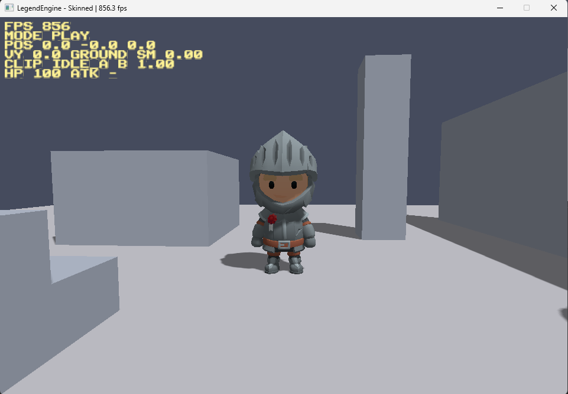
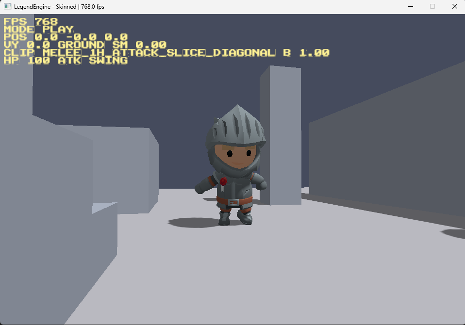
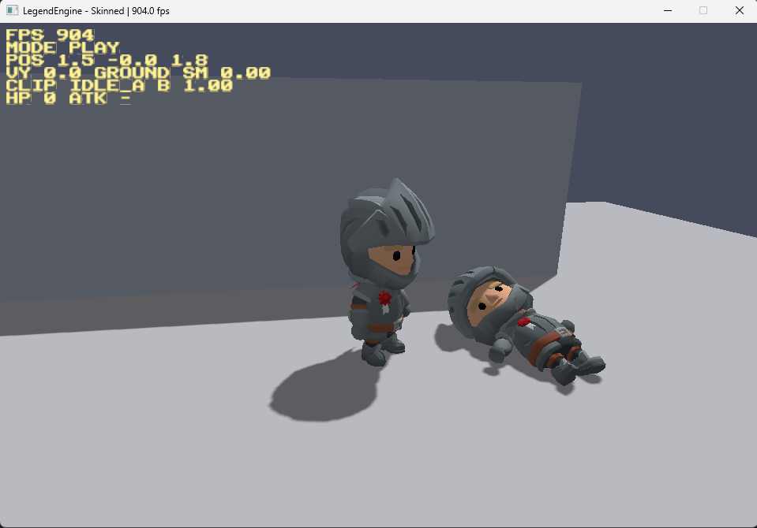
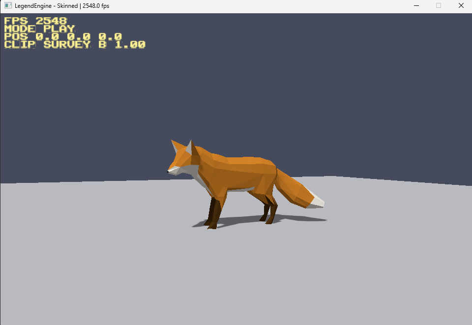

# LegendEngine

**A 3D game engine you can hold in your head — Zig, Vulkan, and nothing you don't need.**

[](LICENSE)
[](https://ziglang.org)
[](#requirements)
[](#project-status)

LegendEngine is a from-scratch 3D engine for **PC action games**, written in [Zig](https://ziglang.org).
It talks to **Vulkan** directly, opens a window with **SDL3**, and compiles its shaders from
**[Slang](https://shader-slang.org)**. On top of that sit a renderer, a scene graph, a glTF asset
pipeline, and skeletal animation — small enough that one person can read the whole thing and change
any part of it.

It is not trying to be Unreal. It is trying to be **the tool one developer needs to finish one game**,
and a foundation you can own, read, and build your own game on top of.

<p align="center">
  
</p>

> ### Project status
> Pre-1.0 and moving fast. Built and maintained by a single developer, targeting Windows + Vulkan.
> Expect breaking changes, missing subsystems (no editor, physics engine, audio, or networking yet),
> and rough edges. It renders and animates textured, shadowed, skinned characters with input and
> basic combat today — it is a working renderer and gameplay foundation, not a finished engine.

## Screenshots

All captured while building LegendEngine.

| Melee attack | Combat & death reactions | glTF model, GPU skinning |
|:---:|:---:|:---:|
|  |  |  |

## Highlights

**Rendering**
- Vulkan rendered directly through `@cImport` — no RHI abstraction, no wrapper library
- Forward renderer with a depth pass, frames-in-flight, and dynamic viewport/scissor
- Shadow mapping with PCF soft shadows (static and skinned casters)
- Slang shaders compiled to SPIR-V at build time and embedded in the binary — a broken shader
  fails the build, not the frame

**Skeletal animation**
- GPU skinning with a per-character bone-matrix palette
- Animation clips with cross-fade blending between them
- **Animation retargeting** — clips authored in separate files bound to a rig by joint name
  (the way a body and its animations are separate assets in Unreal and Unity)
- **Multi-mesh characters** — a body split across many skinned meshes shares one rig and one
  palette (one skeleton per skin, one animator per character)

**Assets**
- glTF 2.0 (`.glb`) loader: meshes, node hierarchy, skins, animations, u8/u16 indices, PBR base color
- OBJ loader
- Self-written PNG, QOI, and PPM image decoders (zlib inflate via `std.compress.flate`)

**Scene**
- Generational slot-map handles for every resource — stale references are caught, not crashed
- GPU resources (`Assets`) kept separate from serializable data (`Scene`)
- Transform hierarchy and a directional light

**Platform & input**
- SDL3 window and Vulkan surface, **built from source** — nothing to install system-wide but the Vulkan SDK
- An action-map input system (stacked contexts; keyboard, mouse motion, and mouse buttons),
  the shape Unreal's Enhanced Input and Unity's Input System both take
- Fixed timestep and an FPS counter

**Gameplay (in the examples)**
- Third-person follow camera and a kinematic character controller
- Capsule / AABB collision queries
- Melee combat with hitstop, knockback, and flinch/death reactions
- A screen-space bitmap-font text overlay

## Philosophy

Why another engine, when Unreal, Unity, Godot, and Bevy exist? LegendEngine differentiates on three things:

- **Rich in what's needed, zero waste.** It carries only the features a game asked for. There is no
  physics engine, audio, or job system yet — unwritten features have no bugs and no maintenance cost.
  You can read the whole engine and keep it in your head.
- **Owned and hackable.** The source is small and open on purpose — no plugin API hiding a black box.
  When you hit a limit, you change the engine, because you can see exactly what the GPU is doing.
- **`comptime` at the core.** Reflection, serialization, and editor/runtime separation are meant to be
  solved at compile time — no macros, no GC, no runtime cost — using what Zig gives for free.

And, as much a discipline as a feature: **PC only, Vulkan only.** No portability layer thins the core.

## Getting started

### Requirements

- **[Zig](https://ziglang.org/download/) 0.16.0** or newer
- **[Vulkan SDK](https://vulkan.lunarg.com/)** — supplies the Vulkan headers, the loader, and `slangc`
  (the Slang shader compiler). The installer sets `VULKAN_SDK`; you can also pass `-Dvulkan-sdk=<path>`.
- A GPU and driver with Vulkan support
- **Windows** is the primary target. The code is kept portable, but other platforms are a post-ship concern.

Everything else — SDL3 and the two small Zig dependencies — is fetched and built from source by `zig build`.

### Build and run

```sh
git clone https://github.com/itsakeyfut/legend.git
cd legend

# Run an example
zig build run-skinned    # a KayKit knight you can walk around, with shadows and combat
zig build run-gltf       # load and view a glTF model (Duck by default)
zig build run-mesh       # a lit, textured Vulkan mesh

# Point an example at your own model
zig build run-skinned -- path/to/model.glb
```

Other steps:

```sh
zig build test           # run the unit tests
zig build fmt            # check formatting
zig build docs           # generate API docs into zig-out/docs
```

## Using LegendEngine in your project

LegendEngine is a Zig module. Add it as a dependency and build **your** game in a separate repository —
the MIT license means your game and any features you stack on top can stay **private or commercial**;
you never have to open-source them.

```sh
zig fetch --save git+https://github.com/itsakeyfut/legend.git
```

```zig
// build.zig
const legend = b.dependency("legend", .{ .target = target, .optimize = optimize });
exe.root_module.addImport("legend", legend.module("legend"));
```

```zig
// your game
const legend = @import("legend");
```

This is the intended model: **a common, open foundation that everyone shares, with the game-specific
work living downstream in each developer's own project.** The public seam is `src/root.zig`.

> Public API stability is a post-first-ship goal — pin a commit while things move.

## Project layout

The engine is one Zig module (`legend`), layered so each level depends only on the ones before it:

```
math      linear algebra (Vec / Mat / Quat), projections — no dependencies
image     PNG / QOI / PPM decoders, pixel buffers
render    mesh, camera, transforms, glTF / OBJ loading, text layout, bitmap font
scene     objects, materials, skeletons, animators, the draw list — pure data over GPU resources
platform  SDL3 window, input action map, fixed timestep
gpu       Vulkan: device, swapchain, pipelines, renderer, shadows, skinning
collision capsule / AABB queries for a kinematic character controller
```

Shaders live in `shaders/` (Slang), examples in `examples/`, and bundled test assets in `assets/`.

## Dependencies

- **[SDL3](https://github.com/castholm/SDL)** — window, input, and Vulkan surface, built from source (zlib license)
- **[slotmap](https://github.com/itsakeyfut/slotmap)** — a generational slot map (own, MIT)
- **[fiber](https://github.com/itsakeyfut/fiber)** — stackful coroutines, the substrate for a future job system (own, split into its own repo)

Saturated, hardened, engine-agnostic layers are borrowed; hot-path, engine-specific layers (the math,
the renderer) are written here. Which is which is stated deliberately, not by accident.

## Documentation

- **[CREDITS.md](CREDITS.md)** — attribution for the bundled third-party assets (KayKit, Khronos glTF samples)
- API documentation: `zig build docs` → `zig-out/docs`
- The design specifications (decisions, rationale, alternatives) are kept private for now while the
  engine takes shape.

## Project status

Actively developed toward a first shippable game. Roughly, what's here vs. what's deliberately deferred
until a game asks for it:

| Working today | Deferred (the "hold" list) |
|---|---|
| Vulkan renderer, shadows, skinning, glTF | Physics engine |
| Animation clips, blending, retargeting | Audio / DSP |
| Scene graph, input, character controller | Job system (fiber substrate exists) |
| Melee combat scaffolding, text overlay | Editor, serialization, scene format |
| | Networking, other platforms |

## Contributing

This is a solo, opinionated project with a clear scope, so large feature contributions may not fit the
roadmap — but issues, bug reports, and questions are welcome. If you build something on top of
LegendEngine, I'd love to hear about it.

## License

LegendEngine is released under the **[MIT License](LICENSE)** — © 2026 itsakeyfut.

Use it, change it, ship commercial games with it, keep your own additions private. All the license asks
is that the copyright notice ride along.

Bundled assets under `assets/` are third-party and carry their own licenses — see **[CREDITS.md](CREDITS.md)**.
